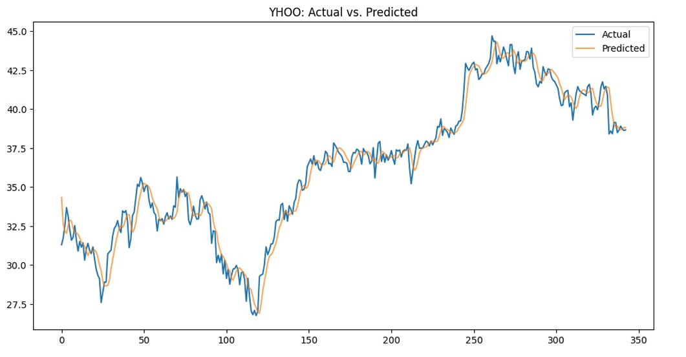

# 📈 Stock Price Prediction using GRU-based Neural Networks


This project implements multivariate time series forecasting using Gated Recurrent Units (GRUs) to predict the **next-day closing prices** of major stocks including Yahoo (YHOO), Microsoft (MSFT), Apple (AAPL), Google (GOOG), and Adobe (ADBE). The model leverages historical OHLCV data with a rolling window strategy and evaluates performance using RMSE in USD.

---

## 🗂️ Project Structure

```
.
├── data/
│   └── prices.csv                 # Full historical stock prices (OHLCV)
├── models/
│   ├── yhoo.h5                    # Saved best model for Yahoo
│   ├── msft.h5                    # Saved best model for Microsoft
│   ├── aapl.h5                    # Saved best model for Apple
│   ├── goog.h5                    # Saved best model for Google
│   └── adbe.h5                    # Saved best model for Adobe
├── notebook/
│   └── stock_price_prediction.ipynb  # Full end-to-end notebook
└── requirements.txt
```

---

## 🧠 Model Overview

- **Architecture**:
  - `GRU(64)` layer for temporal modeling
  - `Dropout(0.2)` to prevent overfitting
  - `Dense(1)` output for next-day close price

- **Input**: 10-day sliding window of 4 features: `open`, `high`, `low`, `close`
- **Output**: Next-day predicted `close` price
- **Loss**: Mean Squared Error (MSE)
- **Optimizer**: Adam

---

## 🔁 Training Highlights

- Trained separately for each stock
- Early stopping & learning rate scheduling used
- Best validation MSE model checkpoint saved

---

## ✅ Results (Test RMSE in USD)

| Stock  | RMSE (USD) |
|--------|------------|
| YHOO   | 0.78       |
| GOOG   | 12.62      |
| MSFT   | 1.10       |
| AAPL   | 3.25       |
| ADBE   | 2.28       |

---

## 🚀 Quick Start

### 1. Install Dependencies

```bash
pip install -r requirements.txt
```

### 2. Train the Model (for a specific stock)

Use the notebook to change `symbol` (e.g., "AAPL", "GOOG") and re-train.

### 3. CLI-based Inference Example

```python
from keras.models import load_model
import numpy as np

# Load model
model = load_model("models/msft.h5")

# Prepare latest sliding window (shape: 1 × 10 × 4)
X_latest = np.load("latest_window.npy")

# Predict
predicted_close = model.predict(X_latest)
print(f"Next-day predicted close: ${predicted_close[0][0]:.2f}")
```

> 📌 Note: `latest_window.npy` must be prepared using the same preprocessing steps as in training.

---

## 📊 Visualization

Each stock’s prediction is plotted against actual prices:

<p align="center">
  
  <br><em>Example: Actual vs Predicted Close (YHOO)</em>
</p>

---

## 📚 Acknowledgments

This project was built using:
- [TensorFlow/Keras](https://keras.io/)
- [scikit-learn](https://scikit-learn.org/)
- [NumPy & pandas](https://pandas.pydata.org/)
- [Yahoo Finance OHLCV data]
